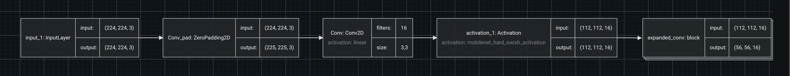

# '디지털 보물찾기(Digital Treasure Quest)' 팀의 '문서 타입 분류' 경연 도전기

## Team

|  |  |  |  |
| :--------------------------------------------------------------: | :--------------------------------------------------------------: | :--------------------------------------------------------------: | :--------------------------------------------------------------: |
|            [박석](https://github.com/parksurk)             |            [백경탁](https://github.com/UpstageAILab)             |            [한아름](https://github.com/UpstageAILab)             |            [위효연](https://github.com/UpstageAILab)             |
|                            Lead, R&D                             |                            R&D                             |                            R&D                             |                            R&D                             |

## 0. Overview
### Environment
- _Write Development environment_

### Requirements
- _Write Requirements_

## 1. Competition Info

### 1.1. Overview

#### 대회 개요

##### 목표
문서 타입 분류를 위한 이미지 분류 모델을 개발합니다.

##### 소개
Document Type Classification 경진대회는 주어진 문서 이미지를 여러 클래스 중 하나로 분류하는 모델을 개발하는 대회입니다. 문서 분류는 금융, 의료, 보험, 물류 등 다양한 산업에서 대량의 문서를 효율적으로 처리하고 자동화하는 데 중요한 역할을 합니다. 참가자들은 다양한 문서 유형을 분류함으로써, 디지털 혁신을 촉진할 수 있는 모델을 개발하게 됩니다.

##### 제공 데이터셋
1. **학습 이미지 데이터**: 17개 클래스에 속하는 1,570장의 문서 이미지
2. **평가 이미지 데이터**: 모델 성능 검증을 위한 3,140장의 문서 이미지
3. **문서 상태 데이터**: 다양한 문서 상태를 반영한 실제 현업 데이터를 기반으로 제작

##### 사용 가능한 알고리즘
딥러닝, 전이 학습, 컨볼루션 신경망(CNN) 등 다양한 이미지 분류 알고리즘을 활용할 수 있습니다. 특히, 다양한 backbone 모델들을 활용하여 문서 이미지 분류의 성능을 극대화할 수 있습니다.

##### 모델링 목표
참가자들은 주어진 문서 이미지를 입력받아 17개의 클래스 중 하나를 예측하는 모델을 개발하는 것이 목표입니다. 이번 대회를 통해 컴퓨터 비전에서 중요한 기술을 적용해보고, 실제 현업에 적용 가능한 성능 좋은 모델을 만들 수 있습니다.

##### 제출 형식
CSV 파일로 결과물을 제출합니다.

- **Input**: 3,140개의 문서 이미지
- **Output**: 3,140개의 예상 문서 타입

자세한 내용은 [대회 페이지](https://stages.ai/en/competitions/319/overview/description)에서 확인하세요.

### 1.2. Timeline

#### 프로젝트 전체 기간
- **2024년 7월 30일 (화) 10:00 ~ 2024년 8월 11일 (일) 19:00**

#### 주요 일정
- **대회 시작**: 2024년 7월 30일 (화) 10:00
- **팀 병합 마감**: 2024년 7월 31일 (수) 10:00
- **개발 및 테스트 기간**: 2024년 7월 30일 (화) 10:00 ~ 2024년 8월 10일 (토) 19:00
- **최종 모델 제출**: 2024년 8월 11일 (일) 19:00

#### 상세 일정
1. **2024년 7월 30일 (화)**: 데이터셋 배포 및 대회 시작
   - 데이터 탐색 및 전처리 시작
   - 팀 구성 및 역할 분담
2. **2024년 7월 31일 (수)**: 팀 병합 마감
   - 초기 모델 개발 시작
   - 데이터 전처리 완료
3. **2024년 8월 1일 (목)**: 모델 성능 검증
   - 초기 모델 학습 및 결과 분석
   - 모델 성능 향상 방안 논의
4. **2024년 8월 2일 (금)**: 모델 개선
   - 딥러닝 모델 구조 개선 및 하이퍼파라미터 튜닝
   - 다양한 전이 학습(backbone) 모델 시도
5. **2024년 8월 3일 (토)**: 모델 테스트
   - 검증 데이터로 모델 성능 평가
   - 에러 분석 및 수정
6. **2024년 8월 4일 (일)**: 피드백 반영
   - 피드백 기반 모델 수정 및 개선
   - 추가 데이터 증강 및 통합
7. **2024년 8월 5일 (월)**: 최적화
   - 모델 최적화 및 성능 극대화
   - 추가 피처 엔지니어링 및 데이터 전처리
8. **2024년 8월 6일 (화)**: 결과 검토
   - 최종 모델 검토 및 테스트
   - 결과 분석 및 문서화 시작
9. **2024년 8월 7일 (수)**: 문서화
   - 모델 개발 과정 및 결과 문서화
   - 최종 검토 및 수정
10. **2024년 8월 8일 (목)**: 최종 점검
    - 최종 모델 점검 및 제출 준비
    - 최종 테스트 및 결과 확인
11. **2024년 8월 11일 (일)**: 최종 모델 제출 및 대회 종료
    - 최종 모델 제출
    - 결과 발표 준비

### 1.3. Evaluation

#### 평가방법

이번 대회는 **문서 이미지 타입 분류**를 목표로 하는 **분류 대회**입니다. 참가자들이 개발한 모델은 **Macro F1 score**를 평가지표로 사용하여 평가됩니다.

##### Macro F1 Score란?
F1 Score는 Precision(정밀도)과 Recall(재현율)의 조화 평균을 의미하며, 클래스 불균형이 존재하는 상황에서 모델의 성능을 더욱 정확하게 평가할 수 있는 지표입니다. Macro F1 Score는 모든 클래스에 대해 개별적으로 계산된 F1 Score의 단순 평균을 의미하며, 모든 클래스에 동일한 가중치를 부여해 모델의 전반적인 성능을 평가하는 데 유용합니다.

##### 계산 방법

##### 평가 기준
- **Macro F1 Score**: 모델이 모든 클래스에서 균일하게 성능을 발휘하는지를 평가합니다. 높은 Macro F1 Score는 모델이 클래스 불균형 문제를 잘 처리했음을 의미합니다.
  
##### Public 및 Private 평가
- **Public 평가**: 전체 Test 데이터 중 랜덤 샘플링 된 50%를 사용하여 Public 리더보드 점수가 산출됩니다.
- **Private 평가**: 전체 Test 데이터 중 나머지 50%를 사용하여 최종 Private 리더보드 점수가 산출됩니다.

자세한 내용은 [참고자료](https://www.linkedin.com/pulse/understanding-confusion-matrix-tanvi-mittal/)를 확인하세요.

## 2. Winning Strategy

### 2.1. DTQ Team's Pros and Cons
#### Pros
- 다양한 경력과 경험을 가진 팀원들
- 평균 나이가 높음
- AI Assistant에 대한 수용력이 높음

#### Cons 
- Git을 활용한 팀단위의 R&D 경험 수준 낮음
- Python기반 R&D 경험 수준 낮음
- 머신러닝/딥러닝 R&D 경험 수준 낮음
- 경연 주제와 관련된 도메인 지식이 낮음
- Career Path에 대한 개인적인 목표가 모두 다름 

### 2.2. DTQ Team's strategic approach
- 첫째, DataRobot과 같은 AutoML 도구를 적극 활용하여 Feature Engineering 과 Model Selection 의 방향성을 잡는다.
- 둘째, 팀원별 서로 다른 머신러닝 모델링을 각 팀원별 수준에 맞게 진행한다.

### 2.3. DTQ Team's culture & spirit
- 경연 참가의 목적은 개인별 학습을 통해 머신러닝 R&D에 필요한 지식과 경험을 얻는 것에 있다.
- 팀원 각각이 처한 상황을 서로 이해하고 인정하고 Respect 한다.
- AI Assistant를 적극적으로 활용하여 개인별 생산성을 극대화 한다.
- 팀 전체 목표을 위해 팀원 개개인의 스케쥴이나 리소스를 희생해서는 안된다.
- 팀원별로 최소한 한번의 제출은 해 본다.

## 3. Components

### 3.1. Directory

- code : 팀원별 실험 소스 코드 및 관련 문서
  - tm1 : 팀원(박석) 실험 소스 코드 및 관련 문서
  - tm2 : 팀원(백경탁) 실험 소스 코드 및 관련 문서
  - tm3 : 팀원(한아름) 실험 소스 코드 및 관련 문서
  - tm4 : 팀원(이승현) 실험 소스 코드 및 관련 문서
  - team : 팀전체 협업을 위한 실험 소스 코드 및 관련 문서
- docs : 팀 문서(발표자료, 참고자료 등)
  - presentation : 발표자료
  - reference : 참고자료
- images : 첨부 이미지
- README.md : 디지털 보물찾기(Digital Treasure Quest)' 팀의 '문서 타입 분류' 경연 도전기 Readme.md

## 4. Data description

### 4.1. Dataset overview

#### 학습데이터
| **Desc**       | **Details**    |
|----------------|----------------|
| Images         | 1,570          |
| File name      | train.csv      |
| Images         | 1,570          |
| Rows           | 1,570          |
| Columns        | 2              |
| ID             | 학습 샘플의 파일명 |
| target         | 학습 샘플의 정답 클래스 번호 |

| **Desc**       | **Details**    |
|----------------|----------------|
| File name      | meta.csv       |
| Rows           | 17             |
| Columns        | 2              |
| target         | 17개의 클래스 번호 |
| class_name     | 클래스 번호에 대응하는 클래스 이름 |

#### 평가데이터
| **Desc**       | **Details**    |
|----------------|----------------|
| File name.     | test.csv       |
| Images         | 3,140          |
| Rows           | 3,140          |
| Columns        | 2              |
| ID             | 평가 샘플의 파일명 |
| target         | 예측 결과가 입력될 컬럼 (값은 전부 0으로 저장됨) |

- 평가 데이터는 학습 데이터와 달리 랜덤하게 Rotation 및 Flip이 적용되었으며, 일부 훼손된 이미지들이 포함되어 있습니다.

### 4.2. EDA

#### Feature Description

| **Feature Name** | **Index** | **Importance** | **Var Type** | **Unique** | **Missing** | **Mean** | **Std Dev** | **Median** | **Min** | **Max** |
|------------------|-----------|----------------|--------------|------------|-------------|----------|-------------|------------|---------|---------|
| target           | 2         | Target         | Numeric      | 17         | 0           | 8        | 4.79        | 8          | 0       | 16      |
| ID               | 1         | Image          |              | 1,413      | 0           |          |             |            |         |         |

| **target** | **class_name**                                            |
|------------|-----------------------------------------------------------|
| 0          | account_number                                            |
| 1          | application_for_payment_of_pregnancy_medical_expenses     |
| 2          | car_dashboard                                             |
| 3          | confirmation_of_admission_and_discharge                   |
| 4          | diagnosis                                                 |
| 5          | driver_lisence                                            |
| 6          | medical_bill_receipts                                     |
| 7          | medical_outpatient_certificate                            |
| 8          | national_id_card                                          |
| 9          | passport                                                  |
| 10         | payment_confirmation                                      |
| 11         | pharmaceutical_receipt                                    |
| 12         | prescription                                              |
| 13         | resume                                                    |
| 14         | statement_of_opinion                                      |
| 15         | vehicle_registration_certificate                          |
| 16         | vehicle_registration_plate                                |

#### Train Image Preview

#### Target Feature

#### Test Image Preview

제공된 이미지를 바탕으로, EDA(탐색적 데이터 분석) 관점에서 학습용(train) 이미지와 테스트(test) 이미지의 차이점을 다음과 같이 설명할 수 있습니다.

#### EDA 결과
##### 1. **시각적 품질 및 상태**:
   - **학습 이미지**: 학습용 이미지들은 비교적 잘 정돈되어 있고 상태도 양호합니다. 문서의 내용이 뚜렷하게 보이며, 노이즈나 왜곡이 거의 없는 것으로 보입니다.
   - **테스트 이미지**: 테스트 이미지들은 품질에 있어서 더 큰 변화를 보입니다. 이미지가 다양한 각도에서 촬영된 것으로 보이며, 회전, 기울기, 손상 또는 열화된 부분이 눈에 띕니다. 문서의 구김, 찢김 등의 물리적 손상이 포함되어 있을 수 있으며, 조명 상태와 그림자도 학습용 이미지에 비해 더 다양하게 나타납니다.

##### 2. **회전 및 방향**:
   - **학습 이미지**: 학습용 이미지들은 대부분 올바르게 정렬된 상태로 방향이 표준화된 것처럼 보입니다.
   - **테스트 이미지**: 테스트 이미지들은 회전이나 방향에서 더 많은 변화를 보입니다. 일부 문서는 기울어져 있거나, 심지어 거꾸로 되어 있을 수 있습니다. 이는 이미지 처리 및 분류 작업에 추가적인 도전 과제를 제시합니다.

##### 3. **문서 유형 및 다양성**:
   - **학습 이미지**: 학습 데이터는 다양한 문서 유형을 대표적으로 포함하고 있으며, 각 클래스에 걸쳐 일관된 형식으로 문서들이 배포된 것처럼 보입니다.
   - **테스트 이미지**: 테스트 데이터는 학습 데이터에 비해 더 폭넓거나 다른 유형의 문서들이 포함되어 있을 가능성이 있습니다. 이러한 다양성은 학습 데이터만으로 훈련된 모델의 성능에 영향을 미칠 수 있습니다.

##### 4. **노이즈 및 배경 변동**:
   - **학습 이미지**: 학습용 이미지에서는 배경과 노이즈 수준이 최소화되어 있어, 문서의 내용에 집중할 수 있도록 되어 있습니다.
   - **테스트 이미지**: 테스트 이미지는 배경 노이즈와 변동이 더 많이 나타나며, 배경 텍스처, 색상, 또는 다른 물체들이 포함될 수 있습니다. 이는 모델이 문서의 텍스트나 특징을 정확하게 추출하고 분류하는 데 방해가 될 수 있습니다.

##### 5. **이미지 해상도 및 크기**:
   - **학습 이미지**: 학습용 이미지들은 해상도가 일정하며, 분류 작업에 적합한 크기를 갖추고 있는 것으로 보입니다.
   - **테스트 이미지**: 테스트 이미지는 해상도나 크기에 있어서 변화가 있을 수 있으며, 이는 모델이 특징을 일관되게 추출하는 데 영향을 미칠 수 있습니다.

##### 7. **블러링 또는 기타 아티팩트**:
   - **학습 이미지**: 학습용 이미지는 블러링이나 모션 아티팩트가 거의 없어 보입니다.
   - **테스트 이미지**: 일부 테스트 이미지는 카메라의 움직임이나 초점 문제로 인해 약간의 블러링이 있을 수 있으며, 이는 OCR(광학 문자 인식)이나 이미지 처리 알고리즘이 내용을 정확하게 인식하는 데 어려움을 줄 수 있습니다.

##### 8. **EDA 결론**:
학습용 이미지와 테스트 이미지의 방향, 품질, 배경 노이즈, 문서 상태 등의 차이점은 학습 데이터로 훈련된 모델이 테스트 데이터에 적용될 때 도전에 직면할 가능성이 높음을 시사합니다. 테스트 세트에서 나타나는 다양한 조건을 반영할 수 있도록 데이터 전처리 단계에서 회전 보정, 노이즈 감소, 학습 데이터의 증강 등의 작업에 신경을 써야 할 것입니다.

### 4.3. Data Processing

#### Augmentation 

#### Data Cleansing
라벨링이 잘못된 데이터에 대해서는 몇개는 수정했으나, 오분류에 대한 기준이 명확하지 않아서(주최측에 분류 기준과 정의에 대해서 문의했지만 답변받지 못했습니다.) 더이상 진행하지 않았습니다.

**[데이터 오염 사례]**

- 레이블 : 10(납입확인서)
- "진료비 납입 영수증" 이라고 적혀 있음.

- 레이블 : 6(진료비 영수증)

- 레이블 : 11(약제비 영수증)

*** 대회 주체측의 의도된 데이터 오염으로 판단했습니다.

## 5. Modeling

### 5.1. Model Selection

#### 모델 검증 안정성
예측할 수 있는 데이터세트에서 패턴을 찾으려면 알고리즘은 먼저 과거 사례(일반적으로 예측하려는 출력 변수가 포함된 과거 데이터세트)에서 학습해야 합니다. 그러나 모델이 훈련 데이터에 대해 너무 밀접하게 훈련되면 과적합될 수 있습니다. 과대적합은 모델이 훈련 데이터에 너무 잘 맞아서 샘플 외부 데이터(모델을 훈련하는 데 사용되지 않은 데이터)에서 제대로 수행되지 않을 때 발생하는 모델링 오류입니다. 과적합은 일반적으로 모델이 포착하려는 기본 추세보다는 훈련 데이터의 특이성과 무작위 노이즈를 설명하는 지나치게 복잡한 모델을 생성합니다. 과적합을 방지하기 위한 가장 좋은 방법은 샘플 외부 데이터에서 모델 성능을 평가하는 것입니다. 모델이 표본 내 데이터(훈련 데이터)에서는 매우 잘 수행되지만 표본 외부 데이터에서는 성능이 좋지 않은 경우 이는 모델이 과적합되었음을 나타낼 수 있습니다.

이를 위해 표준 모델링 기술을 사용하여 모델 성능을 검증하고 과적합이 발생하지 않도록 합니다. 모델 성능의 샘플 외 안정성을 테스트하기 위해 강력한 모델 k-겹 교차 검증 프레임워크를 사용했습니다. 교차 검증 분할 외에도 홀드아웃 샘플을 사용하여 샘플 외 모델 성능을 추가로 테스트하고 모델이 과적합되지 않았는지 확인합니다.
과적합이 발생하지 않도록 개발 중에 다음 절차가 사용되었습니다.
학습 데이터의 20%를 홀드아웃 데이터 세트로 따로 보관했습니다. 이 데이터세트는 학습 과정 전반에 걸쳐 다루지 않은 데이터에 대해 최종 모델이 잘 작동하는지 확인하는 데 사용됩니다.
추가 모델 검증을 위해 나머지 데이터는 5개의 교차 검증 파티션으로 나뉩니다. 대규모 데이터세트로 작업할 때 발생하는 오버헤드를 보상하기 위해 먼저 데이터의 작은 부분에 대해 모델을 학습하고 하나의 교차 검증 접기만 사용하여 모델 성능을 평가합니다.
다음 그림은 CV 프로세스를 요약한 것입니다. 여기서 파란색은 훈련에 사용할 수 있는 데이터의 80%를 나타내며, 교차 검증을 위해 5겹으로 나뉘고 빨간색은 홀드아웃 샘플을 나타냅니다.

#### 데이터 분할 방법론
- Main : 데이터 파티션은 무작위 샘플링을 통해 선택되었습니다.

#### Selected Models
DataRobot과 활용하여 Model Selection 을 수행한 결과를 바탕으로 Leaderboard의 상위권에 속한 다음과 같은 3개의 머신러닝 모델을 선택했습니다.

1. Regularized Logistic Regression L2
2. Keras Slim Residual Neural Network Classifier
3. Baseline Image Classifier

### 5.2. Regularized Logistic Regression L2 (DataRobot)

#### Modeling Descriptions 
기계 학습 방법은 더 유연하고 통계적 가정에 덜 의존하기 때문에 기존 통계 회귀 방법보다 더 정확한 예측 모델을 생성할 수 있습니다. 예를 들어, 일반 최소 제곱 회귀에서는 Gauss Markov 가정이 지원되어야 모델이 편향되지 않고 효율적입니다.
전통적인 통계 회귀 기법은 변수 유의성과 특징 선택(예: t-검정, p-값, 표준 오차)에 대한 공식적인 가설 검정에 의존합니다. 이러한 가설 검정은 데이터에 의해 뒷받침되지 않을 수 있는 분포 및 독립 가정을 갖는 경향이 있습니다. 반면에 기계 학습 방법은 모델 구조를 정의하는 데 더 많은 유연성을 제공하므로 일반적으로 모델 성능이 향상됩니다. 기계 학습에는 모델 타당성을 입증하기 위해 공식적인 가설 테스트에 의존하지 않는 방법이 포함되어 있고 대부분의 기계 학습 접근 방식에서는 경험적 특징 선택 방법(예: 단계적 선택)이 사용되지 않기 때문에 그러한 분포 가정이 필요하지 않습니다. 이 경우 유일한 가정은 모델 훈련 데이터가 미래 점수 데이터를 대표한다는 것입니다. 물론 이러한 가정은 모델의 지속적인 성능 모니터링 프로세스를 통해 면밀히 모니터링되고 추적되어야 합니다.
기계 학습 방법의 일반적인 한계는 과적합 가능성입니다. 과적합은 모델이 기본 훈련 데이터에 너무 가깝게 훈련되어 샘플 외부에서 잘 수행되지 않을 때 발생합니다. 강력한 교차 검증 및 홀드아웃 방법론을 활용하여 모델 성능이 양호하도록 보장하고 과적합 위험을 줄입니다.

모델링 워크플로우는 다음 요소로 구성됩니다.

- Train-Time Image Augmentation
- Pretrained MobileNetV3-Small-Pruned Multi-Level Global Average Pooling Image Featurizer
- Regularized Logistic Regression (L2)

##### Train-Time Image Augmentation
기존 이미지의 복사본을 변환하여 데이터 세트에 새 이미지를 추가합니다.
이는 더 많은 데이터에 노출된 보다 일반화 가능한 모델을 훈련하는 데 도움을 줌으로써 예측 점수를 높일 수 있습니다. 이 기술은 훈련 데이터에 과적합될 위험이 더 높은 소규모 데이터세트에 특히 유용합니다. 더 많은 데이터를 보는 대가로 이는 증강으로 훈련된 모델이 학십시 더 오래 걸린다는 것을 의미합니다. 또한 데이터 세트에 따라 일부 변환으로 인해 예측 점수가 손상될 수 있습니다.

##### Pretrained MobileNetV3-Small-Pruned Multi-Level Global Average Pooling Image Featurizer

이미지 사전 훈련된 CNN 피처라이저를 사용하는데, 사전 훈련된 컨벌루션 신경망을 사용하여 이미지를 숫자형 피쳐 벡터로 변환합니다.
여기서 사용되는 이 방법을 전이 학습이라고 하며, 작업을 위해 개발된 모델을 두 번째 작업의 모델 시작점으로 재사용합니다. 이 방법은 샘플 크기가 작은 데이터세트에 사용할 때와 대상 환경을 완전히 표현할 만큼 대상 데이터세트에 변형이 충분하지 않은 경우에 특히 유용합니다. 가장자리 및 모서리와 같은 낮은 수준의 세부 사항을 포함하는 사전 훈련된 가중치로 초기화된 컨볼루션 신경망의 다양한 수준에서 인간 얼굴 및 차량과 같은 매우 높은 수준의 세부 사항까지 다양한 문제에 대해 잘 일반화되는 피쳐를 추출할 수 있습니다.
생성된 피쳐 벡터(low_level_features, medium_level_features, high_level_features 및 highest_level_features를 기반으로 하는 1~4개)는 다양한 복잡성 수준에서 이미지의 추출된 특성을 나타냅니다. 이후 이러한 피쳐 벡터는 모델러에 대한 입력으로 다운스트림으로 사용됩니다

**사전 훈련된 모델 아키텍처** 
- DarkNet : 이 간단한 신경망은 일괄 정규화, Leaky ReLu 활성화 및 풀링 기능을 갖춘 8개의 3x3 컨볼루셔널 블록으로 구성됩니다. 채널 깊이는 각 블록의 2배만큼 증가합니다. 네트워크에는 최종 Dense 레이어를 포함하여 총 9개의 레이어가 있습니다. https://pjreddie.com/darknet/ 
- DarkNet-Pruned : 이 간단한 신경망은 배치 정규화, Leaky ReLu 활성화 및 풀링 기능을 갖춘 8개의 3x3 컨볼루셔널 블록으로 구성됩니다. 채널 깊이는 각 블록의 2배만큼 증가합니다. 네트워크에는 최종 Dense 레이어를 포함하여 총 9개의 레이어가 있습니다. https://pjreddie.com/darknet/ 이것은 DarkNet과 동일하지만 Conv2D 작업 후에 BatchNormalization 레이어가 제거됩니다.
- EfficientNet-b0 : EfficientNet-b0은 "정확도와 FLOPS를 모두 최적화하는 다목적 신경 아키텍처 검색"을 사용하여 2019년에 개발된 EfficientNet 네트워크 제품군에서 가장 빠른 네트워크입니다. b0 모델은 ImageNet에서 ResNet-50의 상위 1위 및 상위 5위 정확도보다 눈에 띄게 성능이 뛰어나며 매개변수는 5배 더 적습니다(ResNet의 경우 26M, b0의 경우 5.3M). EfficientNet 모델의 주요 구성 요소는 MBConv(Mobile Inverted Residual Bottleneck) 컨벌루션 블록입니다. 이는 SqueezeNet의 화재 모듈과 유사하게 매개변수 수를 제한하기 위해 병목 현상 역할을 하지만 모양이 반대이기 때문에 "역전"됩니다(모바일 반전 잔여 병목 현상에서는 레이어 순서가 확장된 다음 압착됩니다). https://arxiv.org/abs/1905.11946 EfficientNetV2-S-Pruned:EfficientNetV2-S-Pruned는 EfficientNets 제품군의 최신 신경망 부분입니다. EfficientNetV1 모델(2019)의 모든 이전 통찰력을 결합하고 Google Neural Architecture Search에서 새로 발견된 Fused-MBConv 접근 방식 적용: 1. "DepthwiseConv2D 3x3 다음에 Conv2D 1x1"을 "Conv2D 3x3"으로 대체합니다(작업을 Fused-MBConv라고 함). 2. 교육 절차를 개선합니다. 이제 모델은 21,000개가 넘는 클래스의 1,300만 개가 넘는 이미지로 사전 학습되었습니다. 또한 DataRobot은 Conv2D+BatchNorm을 단일 선형 변환으로 병합하여 Conv2D 레이어만 유지하는 레이어 축소 "프루닝 작업"을 적용합니다. 이는 동일한 정확도를 유지하면서 총 레이어 수를 110개로 줄입니다. 자세한 내용은 "EfficientNetV2: 더 작은 모델 및 더 빠른 학습"(https://arxiv.org/pdf/2104.00298)을 참조하세요. https://arxiv.org/pdf/2104.00298 
- EfficientNet-b0-Pruned : EfficientNet-b0 버전의 정리된 아키텍처로, 계층 감소를 의미합니다. Conv2D+BatchNorm 및 DepthWise2D+BatchNorm은 Conv2D/DepthWise만 유지하고 BatchNorm 값을 컨볼루션에 바이어스로 추가하여 단일 선형 변환으로 병합할 수 있습니다. 그 결과 계층이 50개 미만으로 줄어들고 추론 단계가 훨씬 빨라지는 아키텍처가 탄생했습니다. 
- EfficientNet-b4: DataRobot의 신경망은 주어진 데이터 세트에 대해 가장 정확할 가능성이 높습니다.EfficientNet 모델 제품군을 개발하는 주요 목표는 더 많은 계산 비용으로 더 높은 정확도를 얻기 위해 모델 크기를 "확대"하는 간단한 방법을 만드는 것입니다. b4 모델의 구현은 (Efficient-b0에서) 네트워크 너비(각 컨볼루션의 채널 수)를 1.4배, 네트워크 깊이(컨볼루션 블록 수)를 1.8배로 확장하여 보다 정확한 b0보다 느린 모델이지만 결과는 ResNext-101 또는 PolyNet과 비슷합니다. https://arxiv.org/abs/1905.11946 
- EfficientNet-b4-Pruned : EfficientNet-b4 버전의 정리된 아키텍처입니다. Conv2D+BatchNorm 및 DepthWise2D+BatchNorm은 Conv2D/DepthWise만 유지하고 BatchNorm 값을 컨볼루션에 바이어스로 추가하여 단일 선형 변환으로 병합할 수 있습니다. 그 결과 계층이 100개 미만으로 줄어들고 추론 단계가 훨씬 빨라지는 아키텍처가 탄생합니다. 
- MobileNetV3-Small-Pruned:Mobilenet V3는 MobileNet 신경망 제품군의 최신 버전으로 휴대폰 CPU 및 기타 리소스가 적은 장치용으로 특별히 설계되었습니다. MobileNet3-Large와 MobileNet3-Small의 두 가지 변형이 있습니다. MobileNetV3-Large는 높은 리소스 사용량을 목표로 하는 반면 MobileNet3-Small은 낮은 리소스 사용량을 목표로 합니다. MobileNetV3-Small은 거의 동일하거나 더 나은 대기 시간으로 이전 MobileNetV2 네트워크보다 6.6% 더 정확합니다. 이러한 경량 블록 및 작업 외에도 더욱 빠른 특징 추출을 위해 가지치기(pruning)가 적용됩니다. 이 정리된 버전은 동일한 아키텍처를 유지하지만 레이어 수가 현저히 적습니다(~50개). Conv2D + BatchNormalization 및 Depthwise2D + BatchNormalization은 단일 Conv2D 레이어로 병합됩니다. "MobileNetV3 검색" https://arxiv.org/abs/1905.02244 
- PreResNet10 : PreResNet10은 ResNet을 기반으로 합니다. 단, 각 잔여 블록 내에서 배치 노름과 ReLu 활성화는 컨볼루셔널 레이어 _후_가 아닌 _전_에 발생합니다. PreResNet 아키텍처의 이 구현에는 각각 2개의 컨벌루션 블록이 포함된 4개의 PreRes 블록이 있으며, 이는 입력 컨벌루션 레이어와 출력 밀집 레이어를 포함하여 총 10개의 레이어를 생성합니다. 논문(p.14)에 따르면 모델의 계산 복잡성은 네트워크 깊이에 따라 선형적으로 확장되므로 이 모델은 ResNet50보다 약 5배 빠릅니다. 그러나 기능화 도구에서 생성된 기능의 풍부함은 조기 중지 기능이 있는 XGB와 같은 다운스트림 모델러의 피팅 시간에 영향을 미칠 수 있으므로 ResNet50과 같은 더 심층적인 기능화 기능을 사용하여 모델을 훈련하는 데 걸리는 시간은 5배 이상이 될 수 있습니다. https://arxiv.org/abs/1603.05027 
- ResNet50: 이 고전적인 신경망은 건너뛰기 레이어가 포함된 잔여 블록을 기반으로 하며, 이는 여전히 효과적으로 훈련되는 매우 깊은 네트워크를 허용합니다. 각 잔여 블록에서 블록에 대한 입력은 3x3 컨볼루션, 배치 표준 및 ReLu 활성화를 두 번 통해 실행됩니다. 그런 다음 해당 결과가 블록의 입력에 추가되어 해당 결과가 레이어의 잔차로 효과적으로 변환됩니다.ResNet의 이 구현에는 입력 컨벌루션 레이어, 48개의 잔차 블록 및 최종 밀집 레이어를 포함하여 총 50개의 레이어가 있습니다. https://arxiv.org/abs/1512.03385 
- ResNet50-Pruned : 이 고전적인 신경망은 건너뛰기 레이어가 포함된 잔차 블록을 기반으로 하며, 이는 여전히 효과적으로 훈련되는 매우 깊은 네트워크를 허용합니다. 각 잔여 블록에서 블록에 대한 입력은 3x3 컨볼루션, 배치 표준 및 ReLu 활성화를 두 번 통해 실행됩니다. 그런 다음 해당 결과가 블록의 입력에 추가되어 해당 결과가 레이어의 잔차로 효과적으로 변환됩니다. ResNet의 이 구현에는 입력 컨벌루션 레이어, 48개의 잔차 블록 및 최종 밀집 레이어를 포함하여 총 50개의 레이어가 있습니다. ResNet50-Pruned의 유일한 차이점은 Conv2D 작업 후 모든 BatchNormalization 레이어가 제거되어 원래 아키텍처에 비해 레이어가 ~50개 적은 네트워크가 된다는 것입니다. 이를 통해 CPU와 GPU 추론 모두 속도가 훨씬 빨라집니다. https://arxiv.org/abs/1512.03385 
- SqueezeNet : DataRobot에서 가장 빠른 신경망. 이 네트워크는 50배 더 ​​적은 매개변수로 AlexNet의 속도를 달성하도록 설계되어 더 빠른 훈련, 예측 및 저장 크기가 가능합니다. 이는 상대적으로 높은 정확도를 유지하면서 사용되는 매개변수 수를 극적으로 줄이는 것을 목표로 하는 "압착" 레이어와 "확장" 레이어의 조합으로 구성된 소방 모듈의 개념을 기반으로 합니다. SqueezNet v1.1의 이 구현에는 입력 컨볼루션 레이어와 그 뒤에 각각 3개의 컨볼루션이 포함된 8개의 실행 모듈이 있어 총 25개의 레이어가 됩니다. 원본 논문: https://arxiv.org/abs/1602.07360 v1.1에 도입된 차이점에 대한 설명: https://github.com/forresti/SqueezeNet/tree/master/SqueezeNet_v1.1 예외: 이 신경망은 인기 있는 Inception V3 네트워크에 비해 정확도가 향상되었습니다. 이 네트워크는 ResNet-50과 속도는 비슷하지만 일부 데이터 세트에서는 정확도가 더 좋습니다. 이 네트워크의 핵심 아이디어는 교차 채널 상관 관계와 별도로 공간 상관 관계를 학습하여 매개변수를 절약한다는 것입니다. 이 네트워크의 핵심 빌딩 블록은 잔여 레이어가 추가된 깊이별 분리 가능한 컨벌루션(깊이별 컨볼루션 + 포인트별 컨볼루션)입니다(PreResNet-10과 유사). 이 빌딩 블록은 공간 차원(높이 및 너비)에서 발생하는 학습과 채널 차원(깊이)에서 발생하는 학습을 "분리"하여 상호 작용이 다운스트림의 다른 매개 변수에서 학습될 수 있는 별도의 매개 변수에서 처리되도록 하는 것을 목표로 합니다. 네트워크. 이 네트워크에는 너비와 높이가 감소하고 깊이가 증가하는 "엔트리 흐름"의 11개 컨볼루션 레이어와 크기가 일정하게 유지되는 24개의 컨볼루셔널 레이어를 포함하여 총 36개의 컨볼루셔널 레이어가 있습니다. https://arxiv.org/abs/1610.02357 다음은 "속도 클래스"로 그룹화된 아키텍처의 추정치입니다. 
- 정리되지 않은 버전: 첫 번째(가장 빠름): SqueezeNet, PreResNet-10,DarkNet 2위: EfficientNet-b0 3위: ResNet50 4위: ResNet50 5위: Xception 6위: (가장 느림): EfficientNet-b4 정리된 버전: 1위(가장 빠름): MobileneNetV3-Small-Pruned 2위 DarkNet-Pruned 3위: EfficientNet-b0-Pruned 4위: EfficientNet-B4-Pruned 및 EfficientNetV2-S-Pruned 5번째: (가장 느림) ResNet50-Pruned 가능한 경우 정리된 버전을 사용하는 것이 좋습니다. 이러한 신경망 아키텍처의 정확도 순위를 매기는 것은 가능한 모든 데이터 세트(및 입력 기능 데이터 유형)에서 수행하기 어렵지만 속도는 정확도와 느슨하게 반비례 관계에 있습니다. 그러나 더 빠른 모델이 더 정확할 수 있는 데이터 세트의 예가 많이 있습니다(예: squeezenet이 때때로 PreResNet보다 더 정확하거나 EfficientNet-b0이 ResNet-50보다 더 정확할 경우가 많습니다). 또한 하이퍼파라미터 조합(신경망 아키텍처 포함)의 고급 조정은 정확성을 높일 수 있는 예상치 못한 상호 작용을 생성할 수 있다는 점도 주목할 가치가 있습니다. 딥 러닝 하이퍼파라미터 조정은 새로운 연구와 새로운 신경망 아키텍처가 발표됨에 따라 여전히 발전하는 활발한 연구 영역이기 때문입니다. . 정확성을 더 높이려면 EfficientNetV2-S-Pruned 모델을 사용하세요. 이는 Google AI의 컴퓨터 비전에 대한 DL 연구의 최신 버전이기 때문입니다.
- 사용가능한 사전학습 모델 리스트 = [ 'darknet', 'darknet-pruned', 'efficientnet-b0', 'efficientnet-b0-pruned, 'efficientnet-b4', 'efficientnet-b4-pruned', 'efficientnetv2-s-pruned' , 'mobilenetv3-small-pruned', 'preresnet10', 'resnet50', 'resnet50-pruned, 'squeezenet', 'xception', ]'efficientnet-b4', 'efficientnet-b4-pruned', 'efficientnetv2-s-pruned', 'mobilenetv3-small-pruned', 'preresnet10', 'resnet50', 'resnet50-pruned, 'squeezenet', 'xception' , ]'efficientnet-b4', 'efficientnet-b4-pruned', 'efficientnetv2-s-pruned', 'mobilenetv3-small-pruned', 'preresnet10', 'resnet50', 'resnet50-pruned, 'squeezenet', 'xception' , ]

##### Regularized Logistic Regression (L2)
로지스틱 회귀(일명 logit, MaxEnt) 분류자입니다.
로지스틱은 이항 분포를 사용하여 회귀 모델을 이진(0/1) 응답 변수에 맞추는 일반화 선형 모델 클래스입니다. 이는 아마도 가장 널리 사용되는 이진 분류 모델이며 다른 분류기의 성능을 판단하는 데 좋은 기준이 됩니다. 로지스틱 회귀는 사후 처리 없이 잘 보정된 분류 확률을 생성하는 경향이 있다는 점에서 주목할 만합니다.
이 클래스는 liblinear 라이브러리, newton-cg 및 lbfgs 솔버를 사용하여 정규화된 로지스틱 회귀를 구현합니다. 밀도가 높은 입력과 희박한 입력을 모두 처리할 수 있습니다. 최적의 성능을 위해 64비트 부동 소수점을 포함하는 C 순서 배열 또는 CSR 행렬을 사용하십시오. 다른 입력 형식은 모두 변환(및 복사)됩니다.
newton-cg 및 lbfgs 솔버는 원시 공식을 사용하는 L2 정규화만 지원합니다. liblinear 솔버는 L2 페널티에 대해서만 이중 공식화를 사용하여 L1 및 L2 정규화를 모두 지원합니다.
scikit-learn 추정기 sklearn.linear_model.LogisticRegression을 기반으로 합니다.

#### Modeling Process

##### Neural Network

##### Hiperparameters

| **Name**            | **Description (설명)**                                                                                                                                                                                                                                                                                                                                                                                                                                | **Best Searched**          |
|---------------------|----------------------------------------------------------------------------------------------------------------------------------------------------------------------------------------------------------------------------------------------------------------------------------------------------------------------------------------------------------------------------------------------------------------------------------------------------------|----------------------------|
| C                   | 정규화 강도의 역수로, 양수 float 값이어야 합니다. 서포트 벡터 머신과 마찬가지로, 값이 작을수록 더 강한 정규화를 지정합니다. ‘auto’: 'l1' 페널티가 설정된 경우 C의 최저 경계 값에서 1.0e+04까지, 그 외의 경우 1.0e-02에서 1.0e+02까지 log10 척도로 균등하게 배치된 50개의 숫자 그리드입니다. {'floatgrid':[1e-10,1e10],'select':['auto']} 값으로 설정됩니다.                                                                                              | 0.03556480306223128        |
| class_weight        | 주어진 가중치에 따라 각 클래스의 샘플을 과소/과대 표본화합니다. 지정하지 않은 경우, 모든 클래스는 가중치가 1인 것으로 간주됩니다. ‘auto’ 모드는 학습 세트의 클래스 빈도에 반비례하는 가중치를 선택합니다. ['auto'] 값으로 설정됩니다.                                                                                                                                                                                                                   | None                       |
| dual                | 이중 또는 기본 공식입니다. 이중 공식은 l2 페널티와 liblinear 솔버에만 구현되어 있습니다. n_samples > n_features일 때 dual=False를 선호합니다. [False,True] 값으로 설정됩니다.                                                                                                                                                                                                                                                            | False                      |
| fit_intercept       | 상수(바이어스 또는 인터셉트)를 결정 함수에 추가할지 여부를 지정합니다. [False,True] 값으로 설정됩니다.                                                                                                                                                                                                                                                                                                                                                   | True                       |
| intercept_scaling   | 이 옵션은 solver가 liblinear인 경우에만 유용합니다. self.fit_intercept가 True인 경우, 인스턴스 벡터 x는 [x, self.intercept_scaling]이 되어, 값이 intercept_scaling과 동일한 "합성" 특성이 인스턴스 벡터에 추가됩니다. 인터셉트는 intercept_scaling * 합성 특성 가중치가 됩니다. 참고로, 합성 특성 가중치는 다른 모든 특성과 마찬가지로 l1/l2 정규화의 영향을 받습니다. 정규화가 합성 특성 가중치(즉, 인터셉트)에 미치는 영향을 줄이려면 intercept_scaling을 증가시켜야 합니다. [1e-10,1e10] 값으로 설정됩니다. | 1.00001                    |
| penalty             | 페널티에 사용되는 노름(norm)을 지정하는 데 사용됩니다. newton-cg 및 lbfgs 솔버는 l2 페널티만 지원합니다. ['l1','l2'] 값으로 설정됩니다.                                                                                                                                                                                                                                                                                                             | l2                         |
| random_state        | 사용할 의사 난수 생성기의 시드입니다. [0, int(1e9)] 값으로 설정됩니다.                                                                                                                                                                                                                                                                                                                                                                                 | 1234                       |
| tol                 | 종료 기준에 대한 허용 오차입니다. [1e-15,1] 값으로 설정됩니다.                                                                                                                                                                                                                                                                                                                                                                                         | None                       |

##### Confusion Matrix

##### Activation Maps

##### Image Embeddings

### 5.3. Keras Slim Residual Neural Network Classifier (DataRobot)

#### Modeling Descriptions 

모델링 워크플로우는 다음 요소로 구성됩니다.

- Train-Time Image Augmentation
- Pretrained MobileNetV3-Small-Pruned Multi-Level Global Average Pooling Image Featurizer
- RKeras Slim Residual Neural Network Classifier using Training Schedule (1 Layer: 64 Units)

##### Train-Time Image Augmentation
5.2. 참조

##### Pretrained MobileNetV3-Small-Pruned Multi-Level Global Average Pooling Image Featurizer
5.2. 참조

##### Keras Slim Residual Neural Network Classifier using Training Schedule (1 Layer: 64 Units)

신경망은 생물학적 신경망(동물의 중추신경계, 특히 뇌)에서 영감을 받은 모델군으로, 일반적으로 알려지지 않은 수많은 입력에 의존할 수 있는 기능을 추정하거나 근사화하는 데 사용됩니다. 신경망은 일반적으로 서로 메시지를 교환하는 상호 연결된 "뉴런"의 시스템으로 표시됩니다. 연결에는 경험에 따라 조정될 수 있는 숫자 가중치가 있어 신경망이 입력에 적응하고 학습할 수 있게 됩니다.
숨겨진 레이어가 없는 신경망은 사용된 활성화 함수(예: 시그모이드 대 선형 활성화)에 따라 로지스틱 또는 선형 회귀 모델과 동일합니다. (입력 및 출력 계층 사이에) 활성화가 뒤따르는 일련의 뉴런인 "숨겨진 계층"을 신경망에 추가하면 비선형성이 발생합니다. 이를 통해 모델은 특성 간의 비선형 관계를 학습할 수 있으며, 이는 단순한 선형 모델보다 훨씬 더 강력한 모델로 이어질 수 있습니다.
신경망은 옵티마이저와 역전파를 사용하여 학습합니다. 즉, 작은 배치의 데이터를 반복적으로 가져와 예측과 실제의 차이를 계산하고 레이어별로 가중치를 조금씩 조정하여 실제에 가까운 예측을 생성합니다.
이러한 형태의 모델링은 매우 유연하여 임의의 함수를 구성할 수 있지만 일반 회귀 모델보다 입력 데이터에 훨씬 더 민감하므로 일괄 정규화와 같은 특수 기술이 필요합니다. 작업이 텍스트 데이터 내에서 상호 작용을 찾는 것과 관련된 경우 신경망 활용을 확실히 고려하십시오.
Keras는 딥 러닝 모델용 Tensorflow 프레임워크를 사용하여 신경망을 구축하기 위한 고급 라이브러리입니다. Keras는 최첨단 딥 러닝 모델을 DataRobot에 신속하게 통합할 수 있는 유연성을 제공합니다. Keras는 희소 데이터도 지원하는데, 이는 텍스트가 많은 데이터나 여러 수준의 범주형 데이터에 특히 중요할 수 있습니다.
이 클래스는 여러 숨겨진 계층이 있는 표준 신경망 모델뿐만 아니라 자체 정규화 신경망(https://arxiv.org/abs/1706.02515에 설명됨) 및 Residual 연결(예: https://arxiv.org/abs/1712.09913에 설명되어 있음)
자체 정규화 신경망은 배치 정규화를 사용하지 않고도 기울기가 사라지거나 폭발하는 것을 방지하기 위해 매우 구체적인 입력 이니셜라이저와 "Scaled Exponential Linear Units"라는 특수 활성화 함수를 사용합니다.
Residual 네트워크에는 입력에서 출력으로의 직접 연결이 포함되어 있어 손실 함수를 원활하게 하고 네트워크를 더 효과적으로 최적화할 수 있습니다.

#### Modeling Process

##### Neural Network

##### Hiperparameters
| **Name**                          | **Description**                                                                                                                                                                                                                                                                                                                                                                                                                         | **Best Searched**          |
|-----------------------------------|-----------------------------------------------------------------------------------------------------------------------------------------------------------------------------------------------------------------------------------------------------------------------------------------------------------------------------------------------------------------------------------------------------------------------------------------|----------------------------|
| batch_size                        | Keras 신경망은 mini-batch에서 SGD를 통해 학습됩니다. 이 매개변수는 각 mini-batch에 고려할 행 수를 결정합니다. 값이 클수록 학습 속도는 빨라지지만 RAM을 더 많이 사용합니다. 값이 너무 크면 특히 더 복잡한 모델에서 수렴 문제가 발생할 수 있습니다. ‘auto’로 설정된 경우, 데이터셋의 행 수를 기반으로 batch 크기를 계산하는 휴리스틱을 사용합니다. 일반적으로 데이터셋이 클수록 batch 크기가 커지고, 데이터셋이 작을수록 batch 크기가 작아지는 경향이 있습니다. 기본적으로 auto 휴리스틱은 데이터셋에 있는 64개의 행마다 batch 크기를 1씩 증가시키며, 이는 데이터셋마다 다를 수 있습니다. DataRobot은 데이터셋별로 최적의 batch 크기 휴리스틱을 결정합니다. 가능한 값: {‘intgrid’: [1, 131072], ‘select’: [‘auto’]} | 1819                       |
| double_batch_size                 | 1로 설정된 경우, batch 크기는 각 에포크마다 두 배로 늘어나며, 최대 값은 max_batch_size입니다. 가능한 값: [0, 1]                                                                                                                                                                                                                                                                                                                   | 0                          |
| dropout_type                      | 일반 dropout 또는 alpha dropout을 사용할지 여부를 결정합니다. 이는 숨겨진 레이어와 출력 레이어 모두에 적용됩니다. “normal” 또는 “alpha”를 사용하십시오. 가능한 값: [‘normal’, ‘alpha’]                                                                                                                                                                                                                                                    | normal                     |
| early_stopping                    | 개선되지 않은 에포크 수가 이 값에 도달하면 학습이 중단됩니다. early_stopping = 0으로 설정된 경우 조기 중단이 없습니다. early_stopping > 0으로 설정된 경우, 그리드 검색 테스트 세트에서 손실을 확인하고, 해당 손실이 early_stopping 연속 횟수만큼 증가하면 에포크에 도달하기 전에 종료됩니다. stochastic_weight_average_epochs와 early_stopping 중 하나만 0이 아닌 값을 가질 수 있습니다. 가능한 값: [0, 1000] | 0                          |
| epochs                            | 데이터를 통과하는 횟수입니다. 1 에포크는 모델이 학습 데이터의 각 포인트를 정확히 한 번씩 고려함을 의미합니다. 손실이 계산되어 가중치를 업데이트할 때, 그들은 추정된 값과 실제 목표 값의 차이의 작은 부분(학습률에 따라)만큼 변경됩니다. 이 때문에 여러 번, 또는 매우 많은 횟수의 데이터를 통과하도록 선택하는 경우가 종종 있습니다. 가능한 값: [1, 1000]                                                                             | 8                          |
| hidden_activation                 | 숨겨진 레이어에만 사용할 활성화 함수입니다. “relu”와 “prelu”는 일반적으로 좋은 선택입니다. 단위, hidden_dropout, hidden_batch_norm, hidden_l1 및 hidden_l2는 레이어마다 변경될 수 있지만, hidden_activation은 모든 숨겨진 레이어에 대해 동일합니다. 가능한 값: [‘linear’, ‘sigmoid’, ‘hard_sigmoid’, ‘relu’, ‘elu’, ‘selu’, ‘tanh’, ‘softmax’, ‘softplus’, ‘softsign’, ‘exponential’, ‘swish’, ‘mish’, ‘thresholdedrelu’, ‘leakyrelu’, ‘prelu’, ‘cloglog’, ‘probit’] | prelu                      |
| hidden_batch_norm                 | 각 숨겨진 레이어를 배치 정규화할지 여부입니다. 이는 모델의 수렴 속도를 높일 수 있습니다. hidden_batch_norm = 1 및 hidden_dropout > 0을 동시에 설정할 때 주의하십시오. 1 = 배치 정규화 사용, 0 = 배치 정규화 사용 안 함. 모든 숨겨진 레이어에 적용됩니다. 가능한 값: [0, 1]                                                                                                                                                       | 0                          |
| hidden_bias_initializer           | 숨겨진 레이어의 바이어스에 대한 초기화기입니다. 모든 레이어에 사용됩니다. 가능한 값: [‘zeros’, ‘ones’, ‘random_uniform’, ‘lecun_uniform’, ‘glorot_uniform’, ‘he_uniform’, ‘random_normal’, ‘lecun_normal’, ‘glorot_normal’, ‘he_normal’, ‘truncated_normal’, ‘VarianceScaling’, ‘orthogonal’]                                                                                                                                           | zeros                      |
| hidden_dropout                    | 각 전방 패스의 훈련 시 활성화를 무작위로 드롭할 비율입니다. 이를 “dropout”이라고 합니다. 이로 인해 모델이 정규화되며, 일반적으로 일반화가 개선됩니다. 여기에서 제공된 float 값은 각 레이어의 dropout 수준을 결정하는 데 사용됩니다. (모든 숨겨진 레이어에 적용됩니다.) dropout이 없는 경우 0으로 설정합니다. 가능한 값: [0, 0.99]                                                                                                                   | 0.05                       |
| hidden_initializer                | 모델의 숨겨진 레이어에 대한 초기화기입니다. 기본 설정으로 두는 것이 좋습니다. 가능한 값: [‘zeros’, ‘ones’, ‘random_uniform’, ‘lecun_uniform’, ‘glorot_uniform’, ‘he_uniform’, ‘random_normal’, ‘lecun_normal’, ‘glorot_normal’, ‘he_normal’, ‘truncated_normal’, ‘VarianceScaling’, ‘orthogonal’]                                                                                                                       | he_uniform                 |
| hidden_l1                          | 각 숨겨진 레이어에 대해 사용할 L1 정규화입니다. 숨겨진 레이어로 피딩되는 변수를 선택하는 경향이 있습니다. L1 정규화를 사용하지 않으려면 0으로 설정합니다. 이는 손실 함수에서 l1(가중치)에 적용되는 페널티 계수입니다. 모든 숨겨진 레이어에 적용됩니다. 가능한 값: [0, 1000000.0]                                                                                                                                                            | 0.0                        |
| hidden_l2                          | 각 숨겨진 레이어에 대해 사용할 L2 정규화입니다. 숨겨진 레이어로 피딩되는 계수를 축소하는 경향이 있습니다. L2 정규화를 사용하지 않으려면 0으로 설정합니다. 이는 손실 함수에서 l2(가중치)에 적용되는 페널티 계수입니다. 모든 숨겨진 레이어에 적용됩니다. 가능한 값: [0, 1000000.0]                                                                                                                                                            | 0.0                        |
| hidden_units                       | 네트워크의 숨겨진 레이어에 있는 유닛 수입니다. 없는 경우, 모델은 확률적 경사 하강법(SGD)을 통해 적합된 간단한 회귀 모델과 동일하며, 피처 간의 상호작용을 찾지 못합니다. 여러 숨겨진 레이어의 경우 숨겨진 유닛 목록을 지정하십시오, 예: list(512, 256, 128)은 감소하는 유닛 수를 가진 3개의 레이어에 해당합니다. 숨겨진 레이어가 없는 모델을 적합시키려면 “list()”를 사용하십시오. 가능한 값: {‘length’: [0, 25], ‘int’: [1, 8192]}         | [64]                       |
| hidden_use_bias                    | 숨겨진 레이어에 대해 바이어스 항을 사용할지 여부입니다. 모든 레이어에 적용됩니다. 1 = 바이어스 사용, 0 = 바이어스 사용 안 함. 모든 숨겨진 레이어에 적용됩니다. 가능한 값: [0, 1]                                                                                                                                                                                                            | 1                          |
| learning_rate                      | 최적화에 사용되는 학습률입니다. 낮은 학습률은 더 정확한 모델을 만들 수 있지만 수렴하는 데 더 많은 에포크가 필요하며, 국소 최소값에 더 취약합니다. 학습 일정을 사용하는 경우, learning_rate는 최대 학습률을 나타냅니다. 가능한 값: [1e-10, 1000]                                                                                                                                                                                     | 0.03                       |
| loss                               | 모델이 최적화할 손실 함수입니다. 가능한 값: [‘sparse_categorical_crossentropy’]                                                                                                                                                                                                                                                                                                                                                       | sparse_categorical_crossentropy |
| loss_quantile_level                | Quantile 손실이 보정될 quantile 수준입니다. 기본값 0.5는 중앙값에 최적화된 모델과 동일합니다. quantile 손실을 사용하는 모델에만 적용됩니다. 가능한 값: [0.01, 0.99]                                                                                                                                                                                                                                                                    | 0.5                        |
| max_batch_size                     | 모델이 고려할 최대 batch 크기입니다. double_batch_size가 1로 설정된 경우에만 적용됩니다. 가능한 값: [1048, 131072]                                                                                                                                                                                                                                                                                                                     | 131072                     |
| optimizer                          | 모델을 적합시키기 위해 사용할 SGD 변형입니다. ‘adam’을 사용하는 것이 좋습니다. 가능한 값: [‘adam’, ‘sgd’, ‘rmsprop’, ‘adagrad’, ‘adadelta’, ‘adamax’, ‘nadam’, ‘adabound’]                                                                                                                                                                                                                                                        | adam                       |
| output_activation                  | 네트워크의 최종 출력 레이어에 대한 활성화입니다. 기본 설정으로 두는 것이 좋습니다. 가능한 값: [‘linear

##### Training

##### Confusion Matrix

##### Activation Maps

##### Image Embeddings

### 5.4. Baseline Image Classifier (DataRobot)

#### Modeling Descriptions 

모델링 워크플로우는 다음 요소로 구성됩니다.

- Train-Time Image Augmentation
- Grayscale Downscaled Image Featurizer
- RRegularized Logistic Regression (L2)

##### Train-Time Image Augmentation
5.2. 참조

##### Grayscale Downscaled Image Featurizer

그레이스케일 축소 이미지 피쳐화 모듈은 이미지를 로지스틱 회귀 또는 랜덤 포레스트와 같은 다운스트림 모델의 입력 피쳐로 사용되는 숫자 벡터로 변환합니다. 이 "피쳐화" 프로세스는 이미지 크기를 줄이고(20x20 픽셀까지) 회색으로 만들고 단일 1차원 벡터로 병합합니다. 이 피쳐화 도구를 사용하는 모든 모델은 다른 모델에 비해 대부분의 경우 성능이 좋지 않은 간단한 베이스라인 모델 역할을 합니다. 그러나 이러한 베이스라인 모델이 제대로 작동한다면 이는 1) 한 클래스의 이미지가 다른 클래스보다 지속적으로 어둡거나 2) 한 클래스의 이미지에 유사한 패치(예: 워터마크)가 있거나 3) 데이터에 배울 신호가 거의 없거나 없다는 신호입니다. 이는 데이터의 품질 문제가 있는지 데이터를 검사해야 한다는 신호입니다.

##### Logistic Regression with L1 or L2 penalty
5.2. 참조

#### Modeling Process

##### Hiperparameters
5.2. 참조

##### Confusion Matrix

##### Activation Maps

### 5.5. 단위 모델 및 앙상블 모델 (백경탁)

##### 실험 개요
이번 실험들은 다양한 딥러닝 모델을 활용하여 문서 이미지 분류 문제를 해결하기 위해 진행되었습니다. 주로 사용된 모델은 ResNet34, ResNet50, EfficientNet (특히 B4와 B5 버전)이며, 학습률(Learning Rate), 배치 크기(Batch Size), 에포크(Epochs), 조기 중단(early stopping), 가중치 감쇠(weight decay) 등의 하이퍼파라미터를 변경해가며 실험이 진행되었습니다.

#### 주요 결과
1. **초기 실험**에서는 간단한 이미지 증강(Simple Augmentation)과 기본적인 CrossEntropyLoss를 사용하여 ResNet과 EfficientNet 모델의 성능을 평가하였습니다. 초기에는 ResNet34와 ResNet50을 사용한 실험이 주를 이루었으며, 이후 더 성능이 우수한 EfficientNet으로 전환되었습니다.

2. **EfficientNet B4/B5 모델**을 사용한 실험에서는 배치 크기와 에포크 수를 조절하면서 점차 더 높은 정확도와 F1 점수를 기록했습니다. 특히 이미지 증강 기법을 강화하거나, class별로 가중치를 지정하는 등의 기법을 적용하면서 성능이 향상되었습니다.

3. **가중치 감쇠(weight decay)**와 **조기 중단(early stopping)** 기법이 함께 사용된 실험에서는 과적합을 방지하면서도 높은 검증 성능을 유지하는 결과를 얻었습니다.

4. **Focal Loss**와 같은 특수한 손실 함수와 **Cosine Annealing**과 같은 학습률 스케줄링 방법도 일부 실험에서 적용되었습니다. 이로 인해 일부 실험에서는 더욱 향상된 결과를 얻을 수 있었습니다.

5. 마지막으로, **앙상블 기법**을 통해 여러 모델의 예측 결과를 종합하여 최종적으로 0.9118의 F1 점수를 기록하는 등, 높은 성능을 달성했습니다.

#### 결론
이번 실험에서는 다양한 모델과 하이퍼파라미터 튜닝을 통해 문서 이미지 분류 성능을 최적화하려는 노력이 엿보였습니다. 특히, EfficientNet B4/B5 모델이 뛰어난 성능을 보여줬으며, 적절한 하이퍼파라미터 설정과 고급 기법의 도입이 성능 향상에 큰 기여를 한 것으로 보입니다. 마지막으로 앙상블 기법을 통해 최고의 성능을 달성한 것이 특징입니다.

| NO. | date      | Model                     | image size | Epochs | Learning Rate | Batch size | patience (stop) | Weight decay | Augmentations | k-Fold | loss Function   | 비고                            | Train Loss | Train Accuracy | Train F1 | Valid Loss | Valid Accuracy | Valid F1 | Summit F1 | 소스코드명                                               | 차이  |
|-----|-----------|---------------------------|------------|--------|---------------|------------|-----------------|--------------|---------------|--------|----------------|---------------------------------|------------|----------------|----------|------------|----------------|----------|-----------|----------------------------------------------------------|-------|
| 1   | 08월 04일 | resnet34                   | 224        | 3      | 1.00E-03      | 32         |                 |              | Simple Aug.   |        | CrossEntropyLoss |                                 |            |                |          |            |                |          |           | baseline_code-1resnet34-simpleaug-ep3                   |       |
| 2   | 08월 04일 | resnet34                   | 224        | 5      | 1.00E-03      | 64         |                 |              | Simple Aug.   | 5      | CrossEntropyLoss |                                 |            |                |          |            |                |          | 0.6749    | baseline_code-2kfold                                     |       |
| 3   | 08월 05일 | resnet50                   | 336        | 5      | 1.00E-03      | 64         |                 |              | Simple Aug.   |        | CrossEntropyLoss | train label 수정(8개)          | 0.2159     | 0.9204         | 0.9141   |            |                |          | 0.6791    | baseline_code-3resnet50-simpleaug-ep5                   |       |
| 4   |           |                            |            |        |               |            |                 |              |               |        | CrossEntropyLoss |                                 |            |                |          |            |                |          |           |                                                          |       |
| 5   | 08월 05일 | resnet34                   | 224        | 20     | 1.00E-03      | 64         |                 |              | Simple Aug.   |        | CrossEntropyLoss |                                 | 0.0791     | 0.9745         | 0.9736   |            |                |          | 0.6656    | baseline_code-5resnet34-simpleaug_ep20                  | 0.308 |
| 6   | 08월 05일 | tf_efficientnet_b4         | 224        | 20     | 1.00E-03      | 64         |                 |              | Simple Aug.   |        | CrossEntropyLoss |                                 | 0.0851     | 0.9739         | 0.9733   |            |                |          | 0.6858    | baseline_code-6tf_efficientnet_b4-simaug-ep20           | 0.2875|
| 7   |           |                            |            |        |               |            |                 |              |               |        | CrossEntropyLoss |                                 |            |                |          |            |                |          | 0        |                                                          |       |
| 8   | 08월 06일 | resnet50                   | 224        | 10     | 1.00E-03      | 32         |                 | 31400        | CrossEntropyLoss | 이미지 증강                      | 0.0187     | 0.9939         | 0.9935   |            |                |          | 0.8519    | baseline_code-8aug31400_res50                           | 0.1416|
| 9   | 08월 06일 | tf_efficientnet_b4         | 224        | 10     | 1.00E-03      | 32         |                 | 31400        | CrossEntropyLoss | 15700                          | 0.0282     | 0.9908         | 0.9904   |            |                |          | 0.8782    | baseline_code-9-0aug31400_eff_b4_ep10                   | 0.1122|
| 10  | 08월 06일 | tf_efficientnet_b4         | 224        | 5      | 1.00E-03      | 32         |                 | 31400        | CrossEntropyLoss | 15700                          | 0.0582     | 0.9812         | 0.9801   |            |                |          | 0.8618    | baseline_code-9-1aug31400_eff_b4_ep5                    | 0.1183|
| 11  | 08월 06일 | tf_efficientnet_b4         | 224        | 15     | 1.00E-03      | 32         |                 | 31400        | CrossEntropyLoss | 15700                          | 0.0241     | 0.9925         | 0.9922   |            |                |          | 0.8868    | baseline_code-9-2aug31400_eff_b4_ep15                   | 0.1054|
| 12  | 08월 06일 | tf_efficientnet_b4         | 224        | 20     | 1.00E-03      | 32         |                 | 31400        | CrossEntropyLoss | 15700                          | 0.0191     | 0.9943         | 0.9941   |            |                |          | 0.8793    | baseline_code-9-3aug31400_eff_b4_ep20                   | 0.1148|
| 13  | 08월 07일 | tf_efficientnet_b4         | 224        | 15     | 1.00E-03      | 32         |                 | 47100        | CrossEntropyLoss | 15700                          | 0.0118     | 0.9962         | 0.9961   |            |                |          | 0.8925    | baseline_code-10-0aug47100_eff_b4_ep15                  | 0.1036|
| 14  | 08월 07일 | tf_efficientnet_b4         | 224        | 15     | 1.00E-03      | 32         |                 | 47100        | CrossEntropyLoss | 15700                          | 0.0261     | 0.9925         | 0.9923   |            |                |          | 0.8807    | baseline_code-10-1aug47100_eff_b4_ep15_decay0001        | 0.1116|
| 15  | 08월 07일 | tf_efficientnet_b5         | 224        | 15     | 1.00E-03      | 32         |                 | 47100        | CrossEntropyLoss | 15700                          | 0.012      | 0.9964         | 0.9962   |            |                |          | 0.8773    | baseline_code-11-0aug47100_eff_b5_ep15                  | 0.1189|
| 16  | 08월 07일 | tf_efficientnet_b4         | 224        | 10     | 1.00E-03      | 32         | 3               | 1.00E-04     | 47100           | CrossEntropyLoss | 15700      | 0.0435     | 0.9858         | 0.985    | 0.0298     | 0.9897         | 0.989    | 0.8851    | baseline_code-12-0aug47100_eff_b4_estop_decay0001        | 0.1039|
| 17  | 08월 08일 | tf_efficientnet_b4         | 224        | 7      | 1.00E-03      | 32         | 5               | 1.00E-04     | 62800           | CrossEntropyLoss | 이미지 추가증강             | 0.0698     | 0.9763         | 0.9755   | 0.0521     | 0.9828         | 0.9811   | 0.8975    | baseline_code-12-1-aug62800_eff_b4_estop5_decay0001      | 0.0836|
| 18  | 08월 08일 | tf_efficientnet_b5         | 224        | 9      | 1.00E-03      | 32         | 10              | 2.00E-04     | 62800           | CrossEntropyLoss |                                 | 0.0736     | 0.9756         | 0.9747   | 0.0514     | 0.9842         | 0.9833   | 0.
| 19  | 08월 08일 | tf_efficientnet_b4        | 224        | 27     | 1.00E-03      | 32         | 10              | 2.00E-04     | 62800         | CrossEntropyLoss |              | 0.0435     | 0.9869         | 0.9864   | 0.031      | 0.9901         | 0.9893   | 0.8941    | baseline_code-14-aug62800_eff_b4_estop10_decay0002        | 0.0952 |
| 20  | 08월 09일 | tf_efficientnet_b5        | 224        | 5      | 1.00E-04      | 16         | 5               | 0            | 94200         | CrossEntropyLoss | 이미지 추가증강 | 0.0114     | 0.9967         | 0.9966   | 0.014      | 0.996          | 0.9959   | 0.9077    | baseline_code-15-aug94200_eff_b5_estop5_dc0               | 0.0882 |
| 21  | 08월 09일 | tf_efficientnet_b5        | 224        | 19     | 1.00E-04      | 16         | 5               | 0            | 94200         | focal loss      |              | 0.0041     | 0.9977         | 0.9976   | 0.0052     | 0.9967         | 0.9966   | 0.9113    | baseline_code-16-aug94200_eff_b5_estop5_dc0_fl            | 0.0853 |
| 22  | 08월 09일 | tf_efficientnet_b5        | 224        | 23     | 1.00E-04      | 16         | 5               | 0            | 94200         | CrossEntropyLoss | class별 weight지정 | 0.0069     | 0.9983         | 0.9982   | 0.0174     | 0.9977         | 0.9976   | 0.9118    | baseline_code-17-aug94200_eff_b5_estop5_WeightClasses     | 0.0858 |
| 23  | 08월 09일 | tf_efficientnet_b5        | 224        | 13     | 1.00E-04      | 16         | 5               | 0            | 94200         | focal loss      |              | 0.0064     | 0.9966         | 0.9964   | 0.0106     | 0.9962         | 0.996    | 0.9118    | baseline_code-18-aug94200_eff_b5_estop5_focalloss         | 0.0842 |
| 24  | 08월 10일 | tf_efficientnet_b5        | 224        | 17     | 1.00E-04      | 16         | 5               | 2.00E-04     | 94200         | focal loss      |              | 0.0173     | 0.991          | 0.9907   | 0.0099     | 0.9945         | 0.9944   | 0.9074    | baseline_code-19-aug94200_eff_b5_estop5_dc2_focalloss     |        |
| 25  | 08월 11일 | ensemble                  |            |        |               |            |                 |              |               |                |              |            |                |          |            |                |          | 0.9118    |                                                          |        |
| 26  | 08월 11일 | tf_efficientnet_b5        | 224        | 22     | 1.00E-03      | 16         | 5               |              | 94200         | CrossEntropyLoss | cosineAnnealing | 0.0231     | 0.9945         | 0.9941   | 0.0203     | 0.9961         | 0.9961   | 0.91      | baseline_code-21-aug94200_eff_b5_estop5_WeightClasses     |        |
| 27  | 08월 11일 | efficientnet_b5.sw_in12k  | 224        | 14     | 1.00E-04      | 16         | 5               |              | 94200         | CrossEntropyLoss | class별 weight지정 | 0.0155     | 0.9963         | 0.9962   | 0.011      | 0.9977         | 0.9977   | 0.918

### 5.7. 단위 모델 및 앙상블 모델 (한아름)

### 5.8. 단위 모델 및 앙상블 모델 (위효연)

#### 전문가가 되기 전에, 제너럴리스트부터

1. 아서 쾨슬러는 책 **<창조의 행위>**에서 ‘복잡한 문제일수록 무의식 작업이 더 필요하다’고 설명했다. 또한, 그는 기존 통념에 반하지만, 일을 쪼개는 것이 창의적 사고에서 필수라고 주장했다.
2. 특히 그는 너무 합리적 인간(=계산적 인간)이 되지 말라고 주의하며 이렇게 말했다. “합리적 인간은 다차원의 머리가 아닌 일차원의 머리를 가지고 있습니다.”
3. **<늦깎이 천재의 비밀>**을 쓴 데이비드 엡스타인은 어린 나이부터 무수한 반복 훈련을 통해 기량을 연마한 클래식 음악가들을 연구했다. 이들은 의식적 연습으로 똘똘 뭉친 전문가였으며, 쾨슬러가 말하는 합리적 인간들이었다.
4. 반면, 엡스타인은 대부분의 초일류 재즈 음악가들이 어릴 때 현저히 적은 양의 정규 훈련을 받았다는 사실을 발견했다. 이들은 좋아하는 악기에 정착하기 전 다양한 악기를 시도하며 실험하는 시기를 거쳤다.
5. 이들 중에는 악보를 읽는 법조차 배우지 못한 이들도 있었다.
6. 클래식 연주자들의 엄청난 기량을 폄하하려는 것은 아니다. 다만, 엄격한 훈련을 거친 이들 중 즉흥 연주가 안 되는 사람들이 많다. 재즈(=다양화)에서 클래식(=전문화)으로 전향하는 것은 반대 방향보다 훨씬 쉽고 흔하다.
7. 폭넓게 접근하여 전체 지형을 탐사한 후 깊게 한 우물을 파고 들어가는 것이 한 우물을 파다가 폭넓게 탐사하는 것보다 훨씬 쉽다는 것이다.
8. 이는 AI도 마찬가지다. 현재 인공지능 알고리즘은 매우 협소한 영역에서는 상당한 수준에 도달했지만, 여러 영역을 넘나들며 아이디어를 연결 짓는 데는 형편없는 수준이다.
9. 미래의 AI 시대에는 팔방미인이 한 우물을 파는 대가를 이길 확률이 크다.
10. 우리가 전문화(=스페셜리스트)가 아닌 다양화(=제너럴리스트)의 길을 택한다면, 여러 다채로운 경험을 통합해야 한다. 그러기 위해선 쉼과 고요의 시간이 필요하다.
11. 탁월한 제너럴리스트가 되기 위해서는 세상이 제공하는 폭넓은 아름다움에 자신을 노출시키고, 한 발 물러나 이 모든 것을 흡수해야 한다.
12. 우리는 자유롭게 경계를 넘나들며 다양한 열정 간의 공통점을 발견하고, 교집합에 집중함으로써 탁월함에 도달해야 한다.
  **존 피치 외, <이토록 멋진 휴식> 중**

#### 오분류 이미지

[잘못 분류된 이미지](https://www.notion.so/dc4b06b1bcd8411f8e68608935b65639?pvs=21)

#### 참고 ppt 높은 순서

- [F1 score 0.913](https://docs.google.com/presentation/d/1RwgKMpzbraxjYqTCn4eo3yh1iWQ6-Cah/edit#slide=id.p1)
- [5등, F1 score 0.9459](https://docs.google.com/presentation/d/1tnPseHYdyNcAXHh0PZFC0cGfqo8Hxj804wh5fHQhVIc/edit#slide=id.g2b368e284d4_1_75)
- [CV.2.pdf f1 0.9158](https://prod-files-secure.s3.us-west-2.amazonaws.com/9e997f31-cfc9-4db0-aa77-94a6b5d4f1d8/178cdd63-3ec2-4424-a5d7-c56b79163574/CV.2.pdf_(1).pdf)
- [[패스트캠퍼스] Upstage AI Lab 1기_Image Classification_3조.pptx.pdf f1 0.918](https://prod-files-secure.s3.us-west-2.amazonaws.com/9e997f31-cfc9-4db0-aa77-94a6b5d4f1d8/673f1477-a644-488a-8491-7bb62c54b41d/%ED%8C%A8%EC%8A%A4%ED%8A%B8%EC%BA%A0%ED%8D%BC%EC%8A%A4_Upstage_AI_Lab_1%EA%B8%B0_Image_Classification_3%EC%A1%B0.pptx.pdf)
- [CV 05조 발표 (1).pptx 0.9594](https://prod-files-secure.s3.us-west-2.amazonaws.com/9e997f31-cfc9-4db0-aa77-94a6b5d4f1d8/00c2252b-e477-444b-9317-0d746d3a43eb/CV_05%EC%A1%B0_%EB%B0%9C%ED%91%9C_(1).pptx)
- [[패스트캠퍼스] Upstage AI Lab 1기_4조_경진대회 발표자료 (1).pdf 9.9384](https://prod-files-secure.s3.us-west-2.amazonaws.com/9e997f31-cfc9-4db0-aa77-94a6b5d4f1d8/454e703c-6a0c-4f90-b362-1143619f7f5e/%E1%84%91%E1%85%A2%E1%84%89%E1%85%B3%E1%84%90%E1%85%B3%E1%84%8F%E1%85%A2%E1%86%B7%E1%84%91%E1%85%A5%E1%84%89%E1%85%B3_Upstage_AI_Lab_1%E1%84%80%E1%85%B5_4%E1%84%8C%E1%85%A9_%E1%84%80%E1%85%A7%E1%86%BC%E1%84%8C%E1%85%B5%E1%86%AB%E1%84%83%E1%85%A2%E1%84%92%E1%85%AC_%E1%84%87%E1%85%A1%E1%86%AF%E1%84%91%E1%85%AD%E1%84%8C%E1%85%A1%E1%84%85%E1%85%AD_(1).pdf)

- [Upstage CV Classification Repository 1](https://github.com/UpstageAILab/upstage-cv-classification-cv1)

- [Upstage CV Classification Repository 3](https://github.com/UpstageAILab/upstage-cv-classification-cv3)

#### Oversampling

- 이미지 랜덤 회전: 90°/180°/270°/360° 중 랜덤 회전
- 이미지 뒤집기: 수평 또는 수직 방향의 랜덤 뒤집기
- 가우시안 노이즈 추가: 정규분포 노이즈의 적용
- 블러 효과 적용: 모션, Median, 일반 블러 중 선택 적용
- 외곽 회전 보완: 회전 후 남는 외곽을 흰색으로 채움
- 이미지 왜곡 처리: 광학, 그리드, 어파인 변환 중 선택 적용

#### Data Processing

1. 학습 데이터에서 잘못 레이블 되어 있는 데이터를 찾아 수정
2. Augmentation
    - 주어진 학습 데이터의 수(1,570장)가 평가 데이터(3,140장)의 수보다 적고, 정방향의 선명한 학습 데이터와 다르게 평가 데이터는 많이 변형되어 있기 때문에 다양한 augmentation 기법을 활용하여 이를 보완하였음
    - 학습 시간 단축을 위해 augmentation을 거친 이미지를 저장하여 사용하는 offline 방식으로 증강
    - **Albumentation**: Albumentation 라이브러리에서 **Transpose**, **ToGray**, **HorizontalFlip**, **Blur**, **GaussianNoise**, **ShiftScaleRotation** 등을 활용하여 훈련 데이터를 변형하고 데이터의 수를 증강
   - **Augraphy**: Augraphy 라이브러리에서는 **PatternGenerator**, **BrightnessTexturize**와 **InkBleed** 방식을 활용하여 훈련 데이터를 변형하고 데이터 수를 증강
3. 클래스 불균형을 oversampling을 통해 보완

[Upstage CV Classification Repository 4](https://github.com/UpstageAILab/upstage-cv-classification-cv4)

#### Modeling Process

- **이xxxx**
    - 이미지 전처리 시 Resize 대신 문서의 가로 세로 비율이 유지되도록 Padding 적용 -> 성능 향상
    - 예측 결과를 시각화하여 양식이 유사한 3, 7, 14 클래스에 대한 예측 성능이 떨어진다는 것을 확인
        - 3, 7, 14 클래스에 대한 샘플링 가중치를 증가시킴 -> 성능 향상
        - 3, 7, 14 클래스 별도 학습
            - efficientnet_b5 pre-trained 모델로 해당 클래스만 따로 학습하여 기존 결과값 대체 -> 스코어 향상
    - Test-Time Augmentation 적용
        - Inference 단계에서 평가 이미지에 Flip(반전), RandomRotate(90도 단위 랜덤 회전)을 적용해 online 방식으로 augmentation하여 N회 예측 수행
            - 20회 inference 후 soft-voting 앙상블 -> 스코어 향상
    - 리더보드 기준 최상위 예측값들을 hard-voting으로 앙상블 -> 최종 리더보드 Public 스코어 0.9631 달성

- **강xxxxx**
    - 데이터 분할
        - K-Fold Cross-Validation 후 voting
        - 8:2, 9:1 random split
            - 최종 선택: K-Fold Cross-Validation 후 voting
    - 학습률(LR): 0.001 ~ 0.005
        - 최종 선택: 0.001
    - Earlystopping 적용(patience: 2 ~ 5)
        - 최종 선택: 5
    - 손실 함수는 Cross-Entropy Loss 최적화 알고리즘은 Adam 사용
        - 최종 리더보드 Public 스코어 0.9397 달성

- **김xxxxxx**
    - Hybrid EfficientNet Swin-Transformer
        - ImageNet이 사전학습된 EfficientNet 인코더와 swin transformer block을 활용하는 Hybrid Swin Transformer 사용
        - Train Accuracy: 0.8893, Train F1 Score: 0.8546, Validation Accuracy: 0.8604, Validation F1 Score: 0.8224
    - EfficientNet Ensemble
        - EfficientNet B0, B1, B2는 모델 크기와 input image resolution에서 차이가 있으며 B0가 가장 작은 크기를 가지고 B2가 상대적으로 큰 크기를 가짐
        - 각 모델을 K-Fold 진행
        - 세 모델 결과값 hard voting ensemble하여 최종 제출 결과 f1 score 0.9384

- **김xxxxxx**
    - 3, 4, 7, 14 번에 예측 성능이 떨어지는 것을 확인
        - 3, 4, 7, 14번에 클래스 가중치 적용
        - 3, 4, 7, 14번 데이터 추가적인 증강
    - Fine-tuning에서 lr과 batch_size에는 양의 상관관계가 있다는 것을 확인
        - 최적의 조합인 batch_size: 16, lr: 1e-4 사용
    - 최종적으로 상위 3개의 예측값들을 hard-voting으로 앙상블 -> public f1 score 0.9560

[Upstage CV Classification Repository 2](https://github.com/UpstageAILab/upstage-cv-classification-cv2)

#### 문제 해결 방향

문서 자체의 변형에는 Rotate, Crop, Flip이 많은 부분을 차지

> Rotate, Crop, Flip을 기본적으로 진행하고 테스트 데이터와 유사한 노이즈 패턴을 찾아서 적용하자.

> 위 데이터를 잘 학습할 수 있는 BackBone Model를 찾고, 여러 기법을 통해 모델의 성능을 높이자.

- 실제 초반에는 2.5만 개 학습 데이터를 구축하고 기본 모델을 돌린 결과, 0.6206 -> 0.8692로 증가
- 추가로 최종 5만 개를 학습한 결과, 0.8692 -> 0.9340으로 증가해서 Valid data 지표와 리더보드상의 지표의 간격을 낮출 수 있었습니다.

#### 추가 Tip

> 이번 대회는 Test 데이터에 대한 EDA를 많이 신경쓰고 진행해야 한다.

> Augmentation을 어떤 것을 적용했는지, 또한 이것의 특징이 카테고리별로 잘 묶이는지 EDA와 탐지 한번 해볼 것

## 6. Result

### Leader Board

#### Final - Rank 10

#### Submit history
| Final Submission | Model Name               | Submitter | F1 score (Final) | Created at          | Phase    |
|------------------|--------------------------|-----------|------------------|---------------------|----------|
| ☑️               | Ensemble_top9_v1          | 위효연     | 0.9087           | 2024.08.11 18:59    | Complete |
| ☑️               | Ensemble_top6_v1          | 위효연     | 0.9033           | 2024.08.11 18:52    | Complete |
|                  | Ensemble_top3_v1          | 위효연     | 0.7056           | 2024.08.11 18:44    | Complete |
|                  | Datarobot-Re...thAug      | 박석       | 0.6472           | 2024.08.11 13:49    | Complete |
|                  | eff_b5sw_aug...Stop5      | 백경탁     | 0.9005           | 2024.08.11 13:10    | Complete |
|                  | eff_b5_aug94...lloss      | 백경탁     | 0.8942           | 2024.08.11 12:52    | Complete |
|                  | ensemble3                 | 백경탁     | 0.9028           | 2024.08.11 09:36    | Complete |
|                  | ensemble4                 | 백경탁     | 0.9095           | 2024.08.11 09:33    | Complete |
|                  | eff_b5_aug94...Stop5      | 백경탁     | 0.9059           | 2024.08.11 09:17    | Complete |
|                  | EfficientNetB7            | 한아름     | 0.8759           | 2024.08.11 04:29    | Complete |
|                  | EfficientNetB7            | 한아름     | 0.8847           | 2024.08.11 04:25    | Complete |
|                  | ensemble5                 | 백경탁     | 0.9028           | 2024.08.11 00:06    | Complete |
|                  | eff_b5_aug94...lloss      | 백경탁     | 0.9028           | 2024.08.10 23:19    | Complete |
|                  | EfficientNetB4_v1         | 위효연     | 0.7056           | 2024.08.10 18:24    | Complete |
|                  | eff_b5_aug94...lloss      | 백경탁     | 0.9028           | 2024.08.10 03:09    | Complete |
|                  | eff_b5_aug94...Stop5      | 백경탁     | 0.9038           | 2024.08.09 20:24    | Complete |
|                  | eff_b5_aug94...p5_fl      | 백경탁     | 0.8973           | 2024.08.09 14:29    | Complete |
|                  | EfficientNetB5_v5         | 한아름     | 0.7520           | 2024.08.09 05:46    | Complete |
|                  | eff_b5_aug94...Stop5      | 백경탁     | 0.8995           | 2024.08.09 02:38    | Complete |
|                  | eff_b4_aug62...top10      | 백경탁     | 0.8922           | 2024.08.08 18:13    | Complete |
|                  | eff_b5_aug62...top10      | 백경탁     | 0.8919           | 2024.08.08 14:14    | Complete |
|                  | eff_b4_aug62...Stop5      | 백경탁     | 0.8837           | 2024.08.08 10:20    | Complete |
|                  | eff_b4_aug47...Stop3      | 백경탁     | 0.8619           | 2024.08.07 19:08    | Complete |
|                  | EfficientNet-B5_x20       | 한아름     | 0.8970           | 2024.08.07 15:42    | Complete |
|                  | eff_b5_aug47100_ep15      | 백경탁     | 0.8647           | 2024.08.07 14:18    | Complete |
|                  | eff_b4_aug47...y0001      | 백경탁     | 0.8508           | 2024.08.07 12:34    | Complete |
|                  | eff_b4_aug47100_ep15      | 백경탁     | 0.8832           | 2024.08.07 11:24    | Complete |
|                  | EfficientNetB5            | 한아름     | 0.8734           | 2024.08.07 05:11    | Complete |
|                  | eff_aug31400_ep20         | 백경탁     | 0.8763           | 2024.08.07 02:34    | Complete |
|                  | eff_b4_aug31400_ep15      | 백경탁     | 0.8680           | 2024.08.07 01:21    | Complete |
|                  | eff_aug31400_ep5          | 백경탁     | 0.8598           | 2024.08.06 20:37    | Complete |
|                  | eff_multi_au..._ep10      | 백경탁     | 0.8806           | 2024.08.06 20:19    | Complete |
|                  | res50_multi_aug_ep10      | 백경탁     | 0.8486           | 2024.08.06 19:35    | Complete |
|                  | ResNet50_v4-2_x10         | 한아름     | 0.8450           | 2024.08.06 16:03    | Complete |
|                  | resnet50_v4-2_x5          | 한아름     | 0.8297           | 2024.08.06 14:13    | Complete |
|                  | effnet_b4_ep20            | 백경탁     | 0.6705           | 2024.08.05 19:07    | Complete |
|                  | resnet34_aug_epoch20      | 백경탁     | 0.6568           | 2024.08.05 17:50    | Complete |
|                  | aug_basic_resnet50        | 백경탁     | 0.6894           | 2024.08.05 15:46    | Complete |
|                  | base_kfold5               | 백경탁     | 0.6823           | 2024.08.04 16:21    | Complete |
|                  | cv_baseline               | 백경탁     | 0.7230           | 2024.08.04 14:32    | Complete |
|                  | ResNet50_v5-1             | 한아름     | 0.6466           | 2024.08.03 21:31    | Complete |
|                  | ViT_v7                    | 한아름     | 0.5862           | 2024.08.03 21:26    | Complete |
|                  | DenseNet121_v7            | 한아름     | 0.6587           | 2024.08.03 21:23    | Complete |
|                  | ResNet50_v6               | 한아름     | 0.6466           | 2024.08.03 15:13    | Complete |
|                  | ResNet50_v5               | 한아름     | 0.6523           | 2024.08.03 12:33    | Complete |
|                  | ResNst50_v4               | 한아름     | 0.6424           | 2024.08.03 10:32    | Complete |
|                  | Augmentation...Net50      | 한아름     | 0.6375           | 2024.08.03 07:41    | Complete |
|                  | datarobot-ke...ldout      | 박석       | 0.5859           | 2024.08.02 16:21    | Complete |
|                  | ResNet101                | 한아름      | 0.4499           | 2024.08.01 20:43    | Complete |
|                  | datarobot-ke...n-190     | 박석        | 0.6156           | 2024.08.01 11:46    | Complete |
|                  | ResNet-34                | 한아름      | 0.4245           | 2024.07.31 21:35    | Complete |
|                  | datarobot-ke...ation     | 박석        | 0.5940           | 2024.07.31 13:55    | Complete |

### Mentring history

1. 2014.08.09 11:00 Slack 멘토링
   - 한아름님의 질문: 데이터 증강을 통해 Submit F1 Score와 Test F1 Score의 차이를 줄이려고 했으나, 유의미한 개선이 없었음. Stratified K-fold 방식을 사용해 성능이 가장 높은 폴드의 모델로 테스트 데이터를 제출했으며, 이 방법이 올바른지에 대한 고민이 있었음.

   - 한상준 멘토님의 답변:

       - 앙상블 전략 제안: 폴드 모델별로 결과를 합치는 방식으로 앙상블을 시도하는 것을 제안. 예를 들어, 각 폴드 모델의 예측 결과를 voting하여 최종 결과를 도출하는 방법을 추천.
       - Bias 확인: 학습 시 사용한 평가셋(valid)과 제출 결과(test) 간의 경향이 일치하는지 확인할 필요가 있음. 만약 일치하지 않는다면, valid와 test 간에 bias가 있을 가능성을 고려해야 함.
       - 일반화 성능 강조: 퍼블릭 리더보드 점수에만 집중하지 말고, 일반화 성능을 높이는 방향으로 실험과 결과를 근거로 접근할 것을 권장.
       - 앙상블 타이밍: 앙상블을 언제 시도할지에 대한 결정은 팀의 전략에 달렸으며, 추가적인 실험을 통해 더 나은 모델을 만든 후 앙상블을 시도하는 것이 좋을 수도 있다고 언급.

2. 2014.08.09 19:00 ~ 20:00 화상회의 멘토링

    a. **데이터 증강 및 과적합 문제**:
    - 한아름님은 데이터 증강을 10배, 20배로 늘렸지만 Submit F1 Score와 Test F1 Score의 차이가 줄어들지 않는 문제를 겪고 있습니다. 과적합 문제를 해결하기 위해 학습 스케줄러, Dropout, Weight Decay, Batch Normalization 등을 적용했으나 큰 개선은 없었습니다.
    - 멘토님은 데이터셋 클렌징(라벨링 오류 수정)을 고려해 보라고 제안하셨습니다. 학습 데이터와 평가 데이터 사이의 라벨링 오류가 성능 차이의 원인일 수 있기 때문입니다.

    b. **앙상블 모델 적용**:
    - 한상준 멘토님은 여러 모델을 앙상블하는 방법을 제안하셨습니다. 특히, 폴드 모델별로 투표(Voting)하는 방식이 더 적합할 수 있다고 언급하셨습니다. 이를 통해 인퍼런스 과정에서 폴드 모델 5개의 예측값을 비교하여 가장 많이 예측된 값을 제출할 수 있습니다.
    - 또한 특정 클래스에 대해 특정 모델을 우선적으로 사용하는 방법도 고려해볼 수 있다고 제안하셨습니다.

    c. **Submit F1 Score와 Test F1 Score의 차이 줄이기**:
    - 멘토님은 valid(학습시 사용한 평가셋)과 test(서브미션 제출 결과)의 경향이 일치하지 않으면 그 차이가 일반화 성능의 문제일 수 있다고 설명하셨습니다. 퍼블릭 리더보드 점수에만 집중하면 실제 private 평가에서는 일반화 성능이 떨어질 수 있으므로, 최대한 일반화 성능이 높은 모델을 만들어야 한다고 강조하셨습니다.

    d. **실험 및 전략**:
    - 멘토님은 실험을 통해 더 나은 모델을 만들 수 있다면 그 모델을 먼저 만들어 보는 것이 좋다고 권장하셨습니다. 앙상블 기법은 시간이 남는다면 이후에 고려할 수 있는 전략이라고 제안하셨습니다.

    e. 결론적으로, 한상준 멘토님은 과적합 문제를 해결하고 모델의 일반화 성능을 높이기 위해 데이터 클렌징과 앙상블 기법을 포함한 다양한 방법을 시도할 것을 권장하셨습니다.

#### 한상준 멘토 공유 자료
- [Puzzle Mix: Exploiting Saliency and Local Statistics for Optimal Mixup](https://medium.com/snu-aiis-blog/puzzle-mix-exploiting-saliency-and-local-statistics-for-optimal-mixup-a2e841f9cf69)
- [SimCLR: A Simple Framework for Contrastive Learning of Visual Representations](https://github.com/sthalles/SimCLR)
- [Cosine Annealing Learning Rate Scheduler 간단 설명](https://ai4nlp.tistory.com/16)
- [라벨 스무딩(Label smoothing), When Does Label Smoothing Help?](https://blog.si-analytics.ai/21)
- [Ensemble Learning Techniques Tutorial](https://www.kaggle.com/code/pavansanagapati/ensemble-learning-techniques-tutorial)

### Presentation
- [UpStageAILAB-2st-Competition-CV-CLASSIFICATION-Presentation-TEAM5-20240812.pptx](https://docs.google.com/presentation/d/1lOnmn0MsUADTyeOWNKaTfCXTDJgadH6I/edit?usp=sharing&ouid=102302788798357252978&rtpof=true&sd=true)

## etc

### Meeting Log

- [Team 5 Notion](https://www.notion.so/5-a585789549154cb5826a268dc4e864ca) 참고

### Reference

  - [Regularized_Logistic_Regression_(L2)_DocumentTypeClassification-with-Aug-20240809-01_documentation.docx](https://docs.google.com/document/d/1l7gKO9acmysvF1D_nsFNVNYIx9ponasI/edit?usp=sharing&ouid=102302788798357252978&rtpof=true&sd=true)
  - [Keras_Slim_Residual_Neural_Network_Classifier_using_Training_Schedule_(1_Layer__64_Units)_DocumentTypeClassification-with-Aug-20240809-01_documentation.docx](https://docs.google.com/document/d/1l7UeGKvm9-SoghGWA59yKChpnNE5jL4Y/edit?usp=sharing&ouid=102302788798357252978&rtpof=true&sd=true)
  - [Baseline_Image_Classifier_DocumentTypeClassification-with-Aug-20240809-01_documentation.docx](https://docs.google.com/document/d/1lMoR_lqrLNtQXx9fhatJPXeuTHJxoEza/edit?usp=sharing&ouid=102302788798357252978&rtpof=true&sd=true)